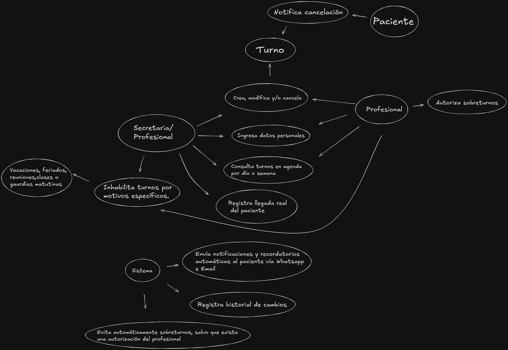

### Anexo - Introducción al Diseño Orientado a Objetos
El diseño orientado a objetos es un enfoque conceptual que organiza el software como una colección de objetos que contienen tanto datos como comportamientos, este paradigma se centra en modelar objetos del mundo real o simulados, dividiendo el sistema en unidades independientes.
# Los cuatro fundamentos de POO
- Encapsulación: Protege los datos restringiendo el acceso, se realiza exclusivamente a través de interfaces públicas o métodos, que promuevan la seguridad y modularidad.
- Herencia: Premite crear una clase nueva a partir de una clase base, heredando sus atributos y comportamientos.
- Polimorfismo: Es la capacidad que tienen diferentes objetos en una jerarquía de clases para responder de manera distinta a un mismo mensaje o comando.
- Abstracción: Es el proceso de simplificar lo complejo, ocultando detalles innecesarios para el usuario.

# Requisitos iniciales del sistema
## Requisitos funcionales
- RF1 El sistema debe crear, reprogramar y cancelar turnos de manera ágil.
- RF2 Tener la capacidad de visualizar la agenda por día y semana.
- RF3 El sistema debe evitar que se generen conflictos con la agenda (doble turno en un mismo horario).
- RF4 Tiene que permitir configurar el horario base del profesional (Lunes a viernes de 9-13 y 15-19) y bloquear horarios por vacaciones, feriados, clases o reuniones.
- RF5 No debe permitir sobreturnos automáticos. Debe ser de forma manual por parte del profesional (máximo de dos por día).
- RF6 Debe tener diferentes duraciones predefinidas: 15 min para controles y 30 min para primera consulta. Debe contemplar que la duración real puede diferir de la predefinida.
- RF7 Debe incluirse la funcionalidad para marcar cuando un paciente llega físicamente al consultorio, registrando la hora real de llegada.
- RF8 Debe tener un registro OBLIGATORIO de todas las modificaciones y cancelaciones para resolver cualquier disputa sobre quien cambió un turno.
- RF9 Debe incluir entidades bien definidas para Paciente (Nombre, Teléfono, ID), Profesional, Turno (Estado, fecha, hora, tipo) y registro de presencia.
- RF10 El sistema debe permitir configurar restricciones particulares del profesional:
    - No atender los jueves.
    - No agendar primeras consultas los viernes a última hora.
    - No programar procedimientos los lunes.
    - Manejar una tolerancia de llegada de 10 min para decidir que hacer con el turno.
## Requisitos no funcionales

- RNF1 Debe enviar notificaciones automáticas el día anterior al turno, via WhatsApp (principal) y Mail.
- RNF2 La interfaz debe ser simple e intuitiva para que el profesional pueda utilizarla sin requerir un aprendizaje complejo.
- RNF3 El sistema debe ser diseñado de forma que permita el crecimiento futuro a múltiples medicos y consultorios sin romper el modelo base.
- RNF4 El sistema debe impedir usos incorrectos mediante un buen encapsulamiento de la lógica de negocio. Objetivo primordial es garantizar que no se superpongan turnos(salvo excepciones autorizadas).
- RNF5 El equipo de desarrollo tiene que priorizar un modelo inicial correcto y un diseño estable. No se deben realizar "parches", sino trabajar con referencias minimas para asegurar la mantenibilidad.
- RNF6 El sistema debe ser funcional para principios de Julio.
- RNF7 El modelo debe manejar conceptos del dominio ("intervalos de tiempo", "disponibilidad") de forma abstracta, no solo como datos técnicos o números sueltos, para reflejar fielmente el funcionamiento real del consultorio.

# Casos de uso
 - **1** Gestion de Turnos: 
    - Crear turno: Registrar una cita asignando paciente, profesional, fecha, hora y tipo de consulta.
    - Reprogramar turnos: Mover una cita existente a un nuevo horario o fecha, asegurando que se notifique al paciente. 
    - Cancelación de turnos: Dar de baja un turno programado, registrando el motivo y notificando el cambio.
    - Autorizar sobreturno: Permitir la asignación de un paciente a un horario ya reservado. Esta es una decisión manual que debe ser autorizada por el profesional con un máximo de dos por día.
-  **2** Visualización y Control:
    - Visualizar agenda: Capacidad de consultar los turnos programados con una vista por día o por semana para cada profesional
    - Registrar Presencia: Registrar cuando un paciente llega físicamente al consultorio, con el horario de llegada real.
    - Historial de cambios: Registro de todas las modificaciones (creación, cambios y cancelaciones) con el fin de resolver disputas o dudas sobre la agenda.
- **3** Configuración de Disponibilidad:
    - Manejar disponibilidad base: Configurar horarios de atención habituales (Lunes a Viernes de 9-13 y 15-19).
    - Bloquear horarios: Inhabilitar turnos por motivos específicos como vacaciones, feriados, reuniones o guardias matutinas.
    - Definir restricciones de agenda: Establecer reglas específicas para no permitir primeras consultas los viernes a última hora o no programar procedimientos los lunes.
- **4** Funciones Automatizadas:
    - Evitar conflictos de agenda: Impedir automáticamente la superposición de dos turnos en el mismo horario, salvo que exista una autorización a dicho sobreturno.
    - Enviar notificaciones y recordatorios: Enviar avisos automáticos vía Whatsapp e Email al paciente el día anterior al turno y notificar inmediatamente ante cualquier cambio o cancelación.
- **5** Interacción del Paciente:
    - Notificar cancelación: Permitir que el paciente informe que no podrá asistir. Debe quedar registrado formalmente en el sistema.
### Boceto inicial de clases

[Ver en línea](https://excalidraw.com/#json=J1eBXHIj3IBlwhIzJKmiP,bWudUZzqzcJI5R_ekfiqHQ)